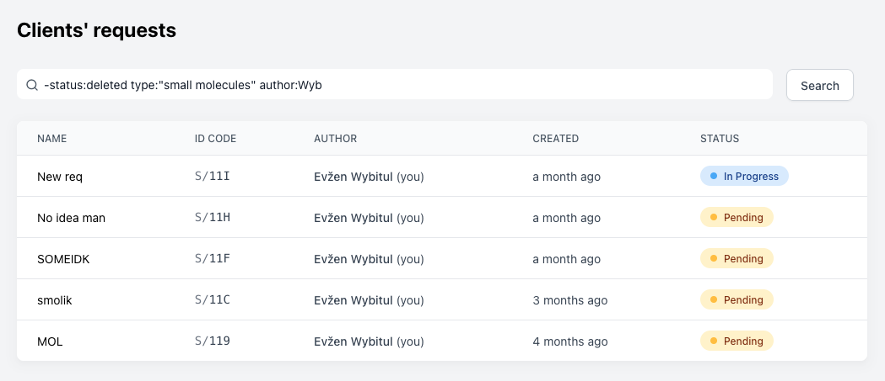
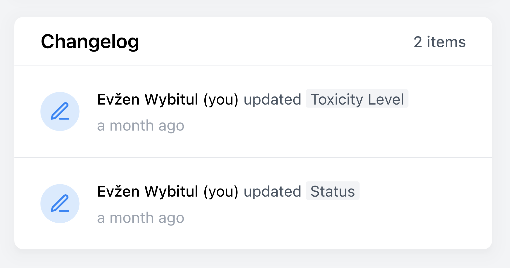

# 

Request management system for analytical labs.

No more tracking requests on paper! Request 2 is a web service that moves the bulk of request specification and request tracking online.


## Workflow

At the beginning, your analytical lab has to make one or more templates (or _forms_) that specify what information you need from your clients. You only need to do this once.

From then on, the workflow looks like this:

1. A client logs into Request 2 and fills in one of the predefined forms in his web browser.
2. You receive an automatic email notifying you there's a new request wating to be done.
3. You check the request details online, and then do the requested measurement. Sadly, we can't yet do the latter automatically :-(
4. When you're done, you submit the results on the page of the client's request. He receives an email that the request has been completed.

You can get back to your client anytime and ask for clarification or further details in the comments section on the request's page.

## Form specification

You can specify the forms for your clients with a simple language based on HTML that can be easily understood even by non-programmers. For example, this code

```jsx
<SingleChoice
  q="Does the sample require any other treatment?"
  id="Requires Other Treatment"
>
  <Option value="No" />
  <Option value="Yes">
    <LongText q="Please specify this treatment" id="Other Treatment Details" />
  </Option>
</SingleChoice>
```

Produces the following form fields


Most common field types are already supported (text, numbers, single and multiple choice, files). For more details, see the demo form in this repo.


## Request tracking

You can easily filter through your client's requests thanks to our query system.



## Request changelog

Every request is editable, to allow clients to correct errors, or fill in additional details. To help you keep track of the changes, they are logged on the page of the request.



# Installation and running

Request2 can be run from docker. You will need a running PostgreSQL database
and some file storage to save the files; the application server will connect to
that from the docker.

To get the complete source, init and update the git submodules:

```
git submodule init
git submodule update
```

Notably, this pulls in 3 other repositories:

- Javascript React app for the frontend (https://github.com/Eugleo/request2-core-frontend)
- Haskell app for the backend API server (https://github.com/Eugleo/request2-core-backend)
- Docker scripts for container building (https://github.com/Eugleo/request2-core-docker)

This repository contains only the minimal lab-specific configuration, namely:

- Form and request specifications in directory `RequestTypes/`
- Configurations of the backend API server and the dockerized mail sender in directory `config/`

## Configuration

Edit `config/request2.cfg` (the configuration of the backend) and
`config/ssmtp.conf` (the configuration of the mail sender from within the
container). Follow the comments in the file for guidance; generally you need this information to fill in everything:

- details about the connection to the PostgreSQL database from inside of your docker container
- details about how to send the mail, preferably a working mail smarthost available from the docker container
- the base URL for your Request web frontend

in `request2.cfg`, you will need a `reg_token_secret` -- that is used as a
random seed for generating password reset tokens. Fill in a randomly generated
string that you keep secret from the public.

## Preparing custom forms

Fill in your form structure to the directory `RequestTypes`. There must be a file `RequestTypes.ts` present in that directory (that one is included by the frontend); otherwise you can add as many other files you need.

You can see the `DemoForm.tsx` for a small demo.

## Bulding the container

Run the following command:

```
docker build -f docker/Dockerfile -t request2-MyLab:latest .
```

Replace `MyLab` in the command with a name that best describes your use.

## Setting up the database

After the container is built, you need to prepare the database structure.

Run the container as follows:

```
docker run request2-MyLab:latest -ti --rm /bin/bash
```

This should open a shell. The backend binary is available in `/root/.cabal/bin/request2`; you may ask it to configure the database (with the connection details you have filled in in the previous steps) as follows:

```
/root/.cabal/bin/request2 -c /srv/config/request2.cfg  create-db
```

If this fails, you need to fix the database connection. You may edit the request2.cfg file in place to test solutions directly from the running container.

Similarly, you may want to send a testing mail, to check if the mail service works correctly:

```
/root/.cabal/bin/request2 -c /srv/config/request2.cfg  mail-test some.user@example.com
```

If the mail sending fails for some reason, you again need to find and correct the problem in your config; this time more likely in the supplied `ssmtp.conf` (also in `/srv/config`).

## Running the service

Starting the docker container with `docker run` will start the backend daemon and serve the content on port 8080. You may need to make the port visible from the outside, and you will certainly want to mount a permanent (backed-up) storage to `/srv/data` inside of the container, for the file storage.

```
docker run --expose 8080 -v /my/reliable/storage:/srv/data
```

Most of the run-time details (internal port, storage mountpoint, etc.) can be easily changed by editing the configuration files in `config/` and `docker/` submodule.

Refer to docker documentation for the possibilities of starting the container automatically and reliably.
